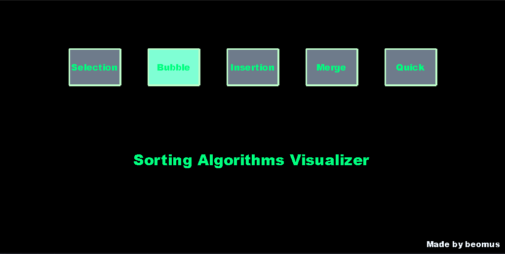
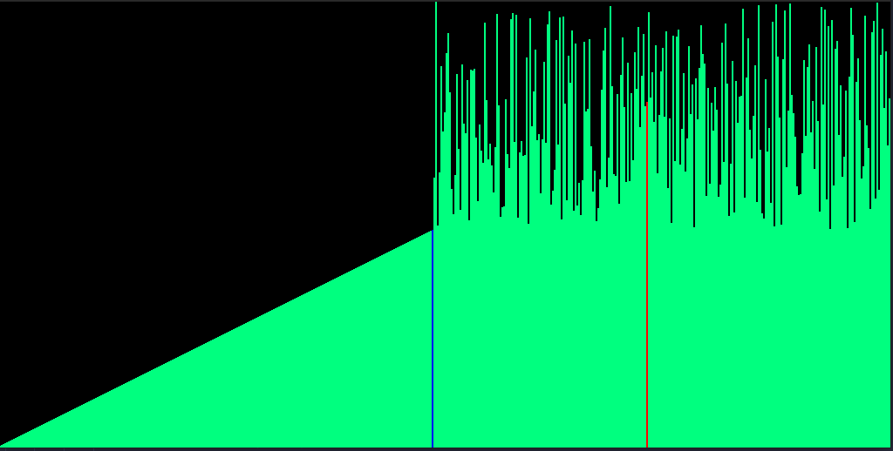
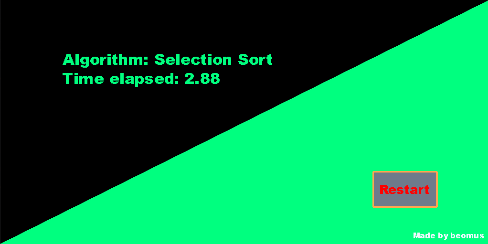

# **A simple sorting algorithms visualizer with Python and Pygame**

## **Requirements:** pygame
`$ pip install pygame`

## **TODO:**
- Find better color theme
- Fix `MergeSort` visualization
- Add more algorithms